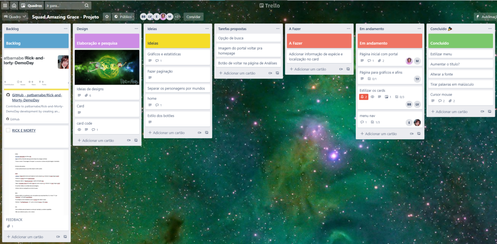
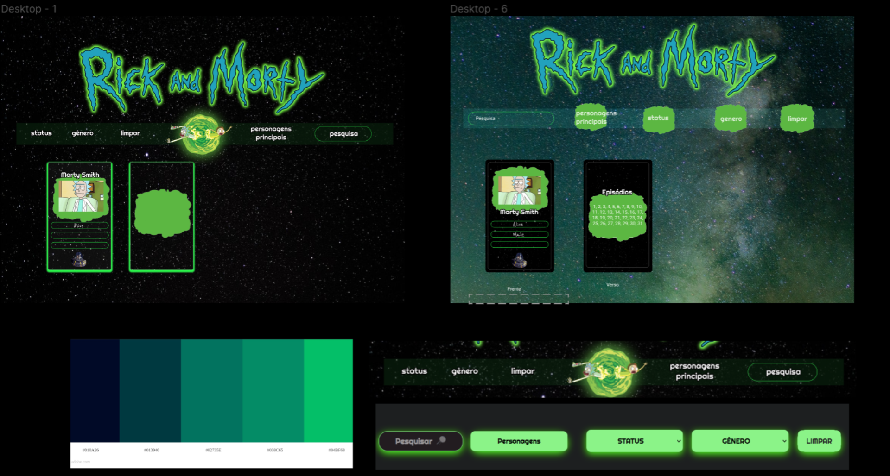
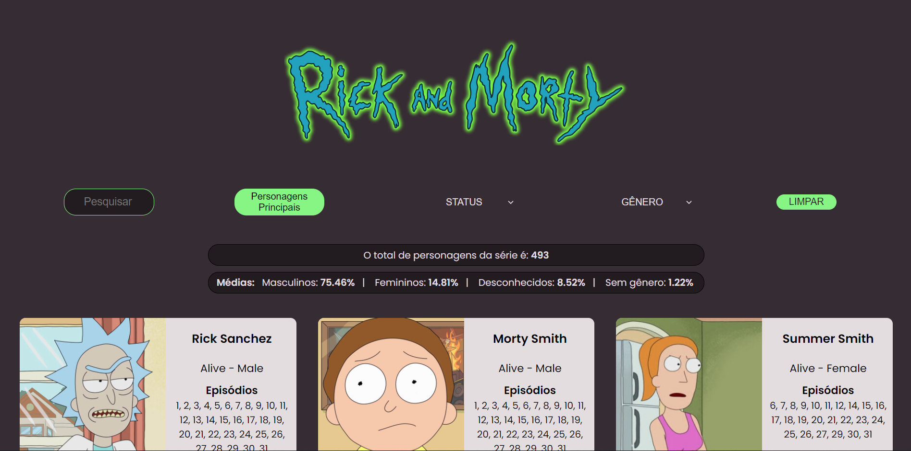
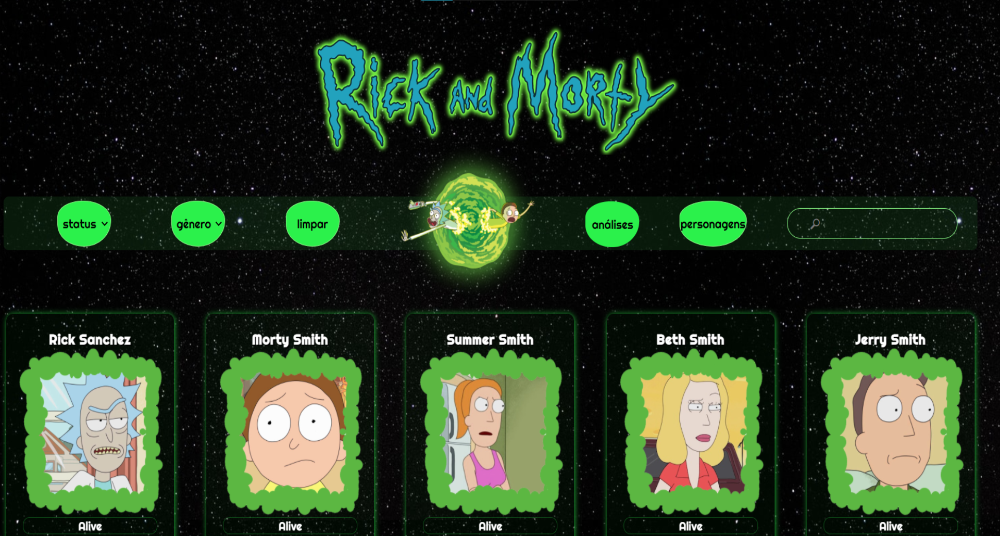

<h1 align="center">Rick e Morty :alien:</h1>

<h2 align="center"> Squad Amazing Grace :woman_technologist: </h2>

<h3 align="center"> Projeto Data Lovers desenvolvido no bootcamp de Front-End da SAP006 Laboratória :yellow_heart:</h3><br>

## Índice

1. [Sobre Rick and Morty](#gun-sobre-rick-and-morty)
2. [O Projeto](#computer-o-projeto)
3. [Definição do Produto](#dart-definição-do-produto)
4. [Planejamento e Organização](#memo-planejamento-e-organização)
5. [Histórias de Usuários](#pencil2-histórias-de-usuários)
6. [Protótipos](#art-protótipos)
7. [Testes de Usabilidade](#busts_in_silhouette-testes-de-usabilidade)
8. [Tecnologias Utilizadas](#robot-tecnologias-utilizadas)
9. [Estrutura dos Principais Arquivos](#file_folder-estrutura-dos-principais-arquivos)
10. [Resultados](#%EF%B8%8F-resultados)
11. [Antes e Depois](#arrows_clockwise-antes-e-depois)
12. [Sobre as desenvolvedoras](#woman_technologist-sobre-as-desenvolvedoras)

---
## :gun: Sobre Rick and Morty

[Rick and Morty](https://pt.wikipedia.org/wiki/Rick_and_Morty) é uma série de animação adulta norte-americana de comédia e ficção científica criada por Justin Roiland e Dan Harmon para o bloco de programação noturno Adult Swim, exibido no canal Cartoon Network.

É uma das animações mais insanas e viciantes produzidas até hoje. Criado inicialmente como uma paródia de De Volta para o Futuro, as aventuras do cientista gênio egoísta Rick e seu neto mais incapaz de pensar que uma porta Morty, conquistou diversos fãs ao redor do mundo.

Rick é um cientista brilhante e está sempre em busca de grandes experiências, indo parar até em universos paralelos. Ele é bem esquentado e sempre sobra para seu neto, Morty, que o acompanha nessas expedições.

---

## :computer: O Projeto

Data Lovers é um guia para os fãs dessa instigante animação, com ele é possível encontrar os personagens da série e filtrá-los de acordo com status e gênero, para que o usuário descubra os episódios em que ele(a) aparecem e possa escolher um para assistir. Também é possível pesquisar por nome e ordenar por número de episódios.
Assim, foram feitas alterações e incrementos no projeto para que ele se adequasse melhor à necessidade de usuário dentro do prazo estimado pelo desafio.
Para acessar o site, clique [aqui](https://rickyandmorty-demoday.netlify.app/).


---

## :dart: Definição do Produto

A aplicação foi desenvolvida para que o usuário possa navegar no site de forma simples e prática, dando destaque aos cards dos personagens e as informações mais relevantes que o usuário deseja encontrar.
A série possui muitos personagens, com diferentes características e assim, buscamos facilitar ao usuário encontrá-los, utilizando opções de filtros, como status e gênero.
Dessa forma, facilitaria a escolha do episódio à assistir e a visualização das informações.

---

## :memo: Planejamento e Organização
O projeto foi realizado por um squad compost pot 7 desenvolvedoras front-end dentro do prazo de 3 dias. O primeiro desafio encontrado foi fazer um planejamento no qual todas pudessem colaborar com ideias, referências e funcionalidades. Para isso, a organização e o planejamento foram feitos em conjunto através do Trello, usando o método FDP (Fatiar, Dispensar e Priorizar). Essa ferramenta também foi utilizada para compartilhar referências e atribuir as tarefas individuais a serem feitas por cada integrante do squad.



---

## :art: Protótipos

O processo de criação foi pensado buscando um layout intuitivo e de fácil compreensão, que mostrasse apenas as informações principais, como imagem/especificações dos personagens, opções de filtro e estatísticas.

Durante o processo, modificamos o design original, removendo o slider maior, pois não tinha uma função definida e o slide com apenas quatro personagens, para que pudessemos printar todos os cards na tela e não somente alguns.

Após trocar essas referências, usamos o Figma para desenvolver o protótipo de alta fidelidade, tendo como base a paleta de cores que escolhemos inspirada na série, onde definimos os cards e a diagramação do site. Trabalhamos com branch’s no github para otimizar o trabalho do squad.



---

## :pencil2: Histórias de Usuários

1) _"O usuário está assistindo a série e gostaria de saber mais sobre os personagens, em qual episódio o personagem aparece, para escolher um ep. para assistir."_

##### Critérios de aceitação:

- [x] O usuário consegue filtrar por status e gênero
- [x] O usuário consegue ordenar para ver os personagens mais frequentes na série
- [x] Ver os personagens em cards
- [x] O usuário pode pesquisar personagens por nome e ver os cards com as informações do personagem.
- [x] O usuário consegue ver uma curiosidade com o total dos personagens e a média de gênero.

##### Definição de pronto:

- [x] Passar nos testes
- [x] Padrão de código: ";" ao final da linha de código e aspas duplas.
- [x] Sem comentários
- [x] Subir pro github
- [x] Sem conflitos/bugs

<br>

2) _"O usuário quer ver impresso na tela, a imagem e informações do personagem com filtro."_

##### Critérios de aceitação:

- [x] O usuário conseguirá ver o card do personagem na tela com a imagem e informações dele

<br>

3) _"O usuário quer ordenar os personagens por número de episódios para encontrar os mais relevantes."_

##### Critérios de aceitação:

- [x] O usuário conseguirá ordenar os personagens por relevância (que aparecem em mais episódios)
- [x] Testes feitos para a função filtrar e para ordenar.

<br>

4) _"O usuário poderá pesquisar os personagens pelo nome."_

##### Critérios de aceitação:

- [x] O usuário pode pesquisar personagens por nome e ver os cards com as informações do personagem.

---

## :busts_in_silhouette: Testes de Usabilidade

De acordo com os resultados dos testes de usabilidade, tiramos o botão de filtrar e, agora, o conteúdo é filtrado assim que o usuário clica na opção desejada de filtro.
E também diferenciamos os seletores de filtro dos outros botões a fim de deixar a experiência do usuário mais intuitiva.
Por fim, mudamos o idioma das opções de select para português.

---

## :robot: Tecnologias Utilizadas

| Ferramenta | Descrição |
| --- | --- |
| `HTML 5` | Linguagem de marcação |
| `CSS3` | Linguagem de estilização |
| `JavaScript` |  Linguagem de programação interpretada estruturada|
| `Jest` | Framework de teste em JavaScript|
| `Node.js` | Software de execução de códigos JavaScript|
| `Git e GitHub` | Sistemas de controle de versões distribuídos|

---

## :file_folder: Estrutura dos Principais Arquivos
```
.
├── 📁 src
|   ├── 📁 data 
|   |   └── 📁 rickandmorty
|   |       ├── 📄 rickandmorty.js
|   |       ├── 📄 rickandmorty.json
|   |       └── 📄 README.md   
|   ├── 📁 img
|   ├── 📄 data.js
|   ├── 📄 index.html
|   ├── 📄 main.js
|   └── 📄 style.css
├── 📁 test
|   └── 📄 data.spec.js
├── 📁 img
├── 📄 README.md
├── 📄 package.json

```

## ✔️ Resultados


<br><br>

<br><br>

<br><br>


## :arrows_clockwise: Antes e Depois

Aqui as alterações são vistas facilmente no antes e depois do projeto. Um dos maiores objetivos das transformações realizadas foi proporcionar ao usuário uma imersão ao universo da série trazendo elementos como o portal, as cores e também trazendo mais informações através dos flip card onde o usuário pode encontrar os dados sobre as espécies e localização dos personagens. Também foi adicionada a página de análises onde são apresentadas todas  as estatísticas sobre o universo da série. 

### Antes



### Depois




---
## :woman_technologist: Sobre as desenvolvedoras

* ### [Bruna Belo](https://www.linkedin.com/in/bruna-belo/)

* ### [Érica Serpa](https://www.linkedin.com/in/ericaserpa/)

* ### [Larissa Maranho](https://www.linkedin.com/in/larissa-maranho/)

* ### [Larissa Vilela](https://www.linkedin.com/in/larissa-vilela-sobral/)

* ### [Michele Martins](https://www.linkedin.com/in/michele-valerio-martins/)

* ### [Patrícia Barnabé](https://www.linkedin.com/in/patriciabarnabe)

* ### [Thais Fernandes](https://www.linkedin.com/in/thaisfernandesjulio/)
